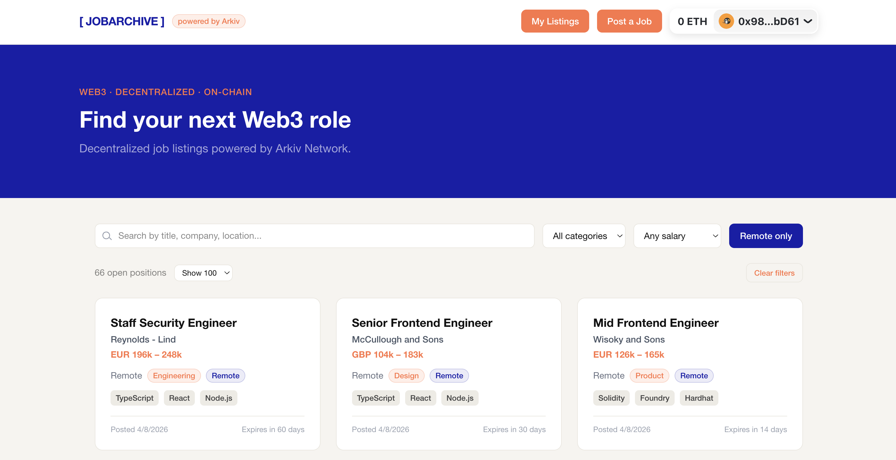

# JobArchive



_JobArchive_ is a decentralized Web3 job board built on [Arkiv Network](https://arkiv.network). Job listings are stored as on-chain entities — no database, no backend, no central authority.

## What it does

- **Browse listings** — search and filter open positions by category, salary range, and more
- **Post a job** — connect a wallet and publish a listing on-chain with an expiration date
- **My Listings** — view all listings owned by your wallet address, powered by Arkiv's owner querying feature
- **Manage listings** — extend or delete your own listings directly from the job detail page

## How it works

Each job listing is an Arkiv entity stored on the Kaolin testnet. Metadata (category, remote or not, compensation, etc.) is stored as typed attributes for filtering. The listing body (title, description, etc.) is stored as a JSON payload. Expiration is block-based — listings expire on-chain automatically.

## Known limitations

- **Kaolin testnet only** — no network switching
- **Some filtering options are done client-side** — title/company/location search filters locally; only category, salary, and remote filters hit the chain

## Running locally

**Prerequisites:** [Bun](https://bun.sh), a wallet private key for the Kaolin testnet and some funds for running the transactions, which can be obtained at the [Kaolin Faucet](https://kaolin.hoodi.arkiv.network/faucet/).

```bash
# Install dependencies
bun install

# Set up environment
cp .env.local.example .env.local
# Fill in ARKIV_PRIVATE_KEY in .env.local

# Start the dev server
bun dev
```

The app runs at `http://localhost:3000`.

### Seeding listings

To populate the board with sample data:

```bash
bun run scripts/seed-jobs.ts
```

This posts a batch of mock listings to Kaolin in a single transaction using the private key in `.env.local`.
